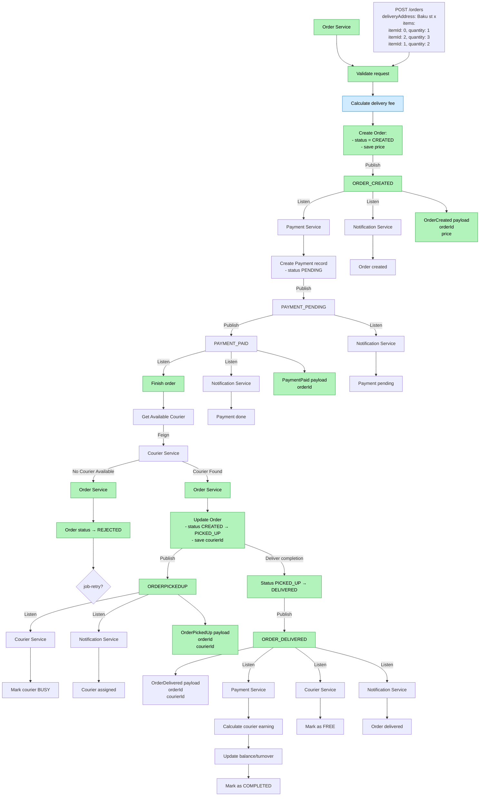

Flow

```mermaid
flowchart TD
  14ac0433fce57f86["Get Available Courier"]
  91527edfbfbd9ee8["Finish order"]
  a87c45f4d9214cc0["Create Order:<br/>- status = CREATED<br/>- save price"]
  0289fa9f1637df03["Calculate delivery fee"]
  de560266975ea96b["Payment Service"]
  37175ff3a5876750["Notification Service"]
  21140290c2169851["OrderCreated payload<br/>orderId<br/>price"]
  e4fb86d54f118361["Validate request"]
  40419d8dc458999c["ORDER_CREATED"]
  3b7555abb3cabca9["Order Service"]
  e5f7e6b70fbb126a["Courier Service"]
  d8a9d91c7ec29889["PAYMENT_PAID"]
  55319bb7f64924b5["PAYMENT_PENDING"]
  bbc4b2529e33d21a["Order Service"]
  d6be672cfcfaf4cd["Order status → REJECTED"]
  4bc5ecd70b7ffba3["PaymentPaid payload<br/>orderId"]
  0080bba929451b35["Payment done"]
  252066866490623b["Payment pending"]
  1b8669cea26b1069["Create Payment record<br/>- status PENDING"]
  b8940efbacbdef76["Order created"]
  f7574025a9aff93f["Order Service"]
  540fbebbae30e113["Update Order<br/>- status CREATED → PICKED_UP<br/>- save courierId"]
  dbb674a8cd2357b2["POST /orders<br/>deliveryAddress: Baku st x<br/>items:<br/>itemId: 0, quantity: 1<br/>itemId: 2, quantity: 3<br/>itemId: 1, quantity: 2"]
  85302abab002c522{"job-retry?"}
  867a60cdc29c64ee["OrderDelivered payload<br/>orderId<br/>courierId"]
  bedfc4dc6c5dfd27["Notification Service"]
  6d6a10c278db04a8["Notification Service"]
  697130f14f715dbe["ORDERPICKEDUP"]
  ea1b0f4b829fafdd["OrderPickedUp payload<br/>orderId<br/>courierId"]
  54c58396ea9110e8["ORDER_DELIVERED"]
  292f69d4dbab9e99["Status PICKED_UP → DELIVERED"]
  86ab0ed880056cc8["Notification Service"]
  42c3ea6675286efd["Courier Service"]
  8bd7560820e73f3a["Courier assigned"]
  cb98b31cdc1602f0["Mark courier BUSY"]
  f800dbfee5209599["Payment Service"]
  3a886a5096a78b35["Courier Service"]
  724a8d7de15ce592["Notification Service"]
  ff46effe9447d225["Update balance/turnover"]
  e9b14d00b77b08be["Calculate courier earning"]
  5046ac9fc36dcb1c["Mark as FREE"]
  06e0c76ad5995c2a["Order delivered"]
  18324ca6e6c47889["Mark as COMPLETED"]

  14ac0433fce57f86 -->|"Feign"| e5f7e6b70fbb126a
  91527edfbfbd9ee8 --> 14ac0433fce57f86
  d8a9d91c7ec29889 -->|"Listen"| 91527edfbfbd9ee8
  a87c45f4d9214cc0 -->|"Publish"| 40419d8dc458999c
  0289fa9f1637df03 --> a87c45f4d9214cc0
  e4fb86d54f118361 --> 0289fa9f1637df03
  de560266975ea96b --> 1b8669cea26b1069
  40419d8dc458999c -->|"Listen"| de560266975ea96b
  37175ff3a5876750 --> b8940efbacbdef76
  40419d8dc458999c -->|"Listen"| 37175ff3a5876750
  40419d8dc458999c --> 21140290c2169851
  3b7555abb3cabca9 --> e4fb86d54f118361
  dbb674a8cd2357b2 --> e4fb86d54f118361
  e5f7e6b70fbb126a -->|"No Courier Available"| bbc4b2529e33d21a
  e5f7e6b70fbb126a -->|"Courier Found"| f7574025a9aff93f
  d8a9d91c7ec29889 -->|"Listen"| 6d6a10c278db04a8
  d8a9d91c7ec29889 --> 4bc5ecd70b7ffba3
  55319bb7f64924b5 -->|"Publish"| d8a9d91c7ec29889
  55319bb7f64924b5 -->|"Listen"| bedfc4dc6c5dfd27
  1b8669cea26b1069 -->|"Publish"| 55319bb7f64924b5
  bbc4b2529e33d21a --> d6be672cfcfaf4cd
  d6be672cfcfaf4cd --> 85302abab002c522
  6d6a10c278db04a8 --> 0080bba929451b35
  bedfc4dc6c5dfd27 --> 252066866490623b
  f7574025a9aff93f --> 540fbebbae30e113
  540fbebbae30e113 -->|"Publish"| 697130f14f715dbe
  540fbebbae30e113 -->|"Deliver completion"| 292f69d4dbab9e99
  54c58396ea9110e8 --> 867a60cdc29c64ee
  697130f14f715dbe -->|"Listen"| 42c3ea6675286efd
  697130f14f715dbe -->|"Listen"| 86ab0ed880056cc8
  697130f14f715dbe --> ea1b0f4b829fafdd
  54c58396ea9110e8 -->|"Listen"| f800dbfee5209599
  54c58396ea9110e8 -->|"Listen"| 3a886a5096a78b35
  54c58396ea9110e8 -->|"Listen"| 724a8d7de15ce592
  292f69d4dbab9e99 -->|"Publish"| 54c58396ea9110e8
  86ab0ed880056cc8 --> 8bd7560820e73f3a
  42c3ea6675286efd --> cb98b31cdc1602f0
  f800dbfee5209599 --> e9b14d00b77b08be
  3a886a5096a78b35 --> 5046ac9fc36dcb1c
  724a8d7de15ce592 --> 06e0c76ad5995c2a
  ff46effe9447d225 --> 18324ca6e6c47889
  e9b14d00b77b08be --> ff46effe9447d225

  style 91527edfbfbd9ee8 fill:#b2f2bb,stroke:#2f9e44,color:#000
  style a87c45f4d9214cc0 fill:#b2f2bb,stroke:#2f9e44,color:#000
  style 0289fa9f1637df03 fill:#d0ebff,stroke:#1c7ed6,color:#000
  style 21140290c2169851 fill:#b2f2bb,stroke:#2f9e44,color:#000
  style e4fb86d54f118361 fill:#b2f2bb,stroke:#2f9e44,color:#000
  style 40419d8dc458999c fill:#b2f2bb,stroke:#2f9e44,color:#000
  style 3b7555abb3cabca9 fill:#b2f2bb,stroke:#2f9e44,color:#000
  style bbc4b2529e33d21a fill:#b2f2bb,stroke:#2f9e44,color:#000
  style d6be672cfcfaf4cd fill:#b2f2bb,stroke:#2f9e44,color:#000
  style 4bc5ecd70b7ffba3 fill:#b2f2bb,stroke:#2f9e44,color:#000
  style f7574025a9aff93f fill:#b2f2bb,stroke:#2f9e44,color:#000
  style 540fbebbae30e113 fill:#b2f2bb,stroke:#2f9e44,color:#000
  style 697130f14f715dbe fill:#b2f2bb,stroke:#2f9e44,color:#000
  style ea1b0f4b829fafdd fill:#b2f2bb,stroke:#2f9e44,color:#000
  style 54c58396ea9110e8 fill:#b2f2bb,stroke:#2f9e44,color:#000
  style 292f69d4dbab9e99 fill:#b2f2bb,stroke:#2f9e44,color:#000
```
